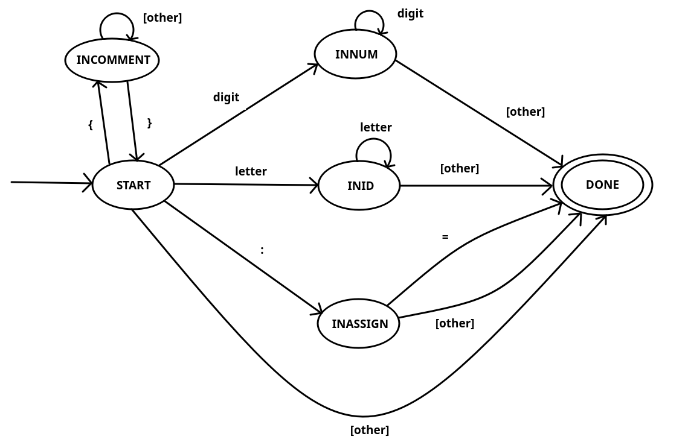
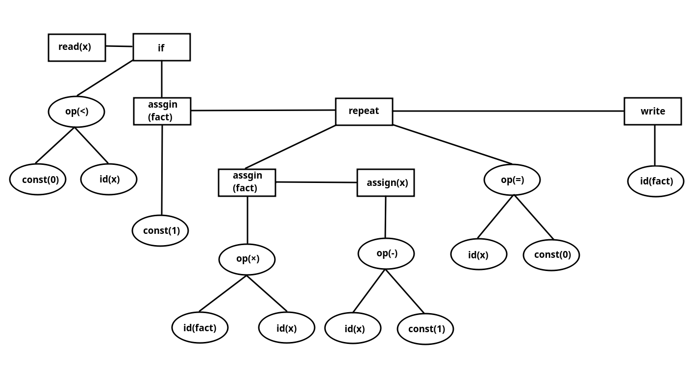
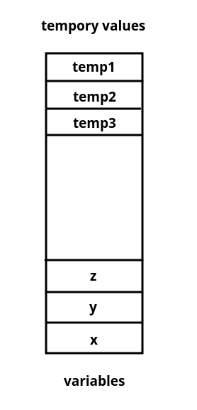

# TINY

TINY, a very simple programming language for studying purpose according to the book 《complier constrction principles and practice》

+ [features](#features)
+ [scanning](#scanning)
+ [parsing](#parsing)
+ [sematic analysis](#analysis)
+ [runtime enviroment](#runtime)
+ [code generation](#code)
+ [more](#code)

## <span id='features'>features</span>

- comment: { comment should be in curly braces }

- datatype: only Integer is supported, and use the implicit declaration

- scope: only one global block

- statement-sequence: stmt1; stmt2; stmt3; ... stmt_n

**note**: since there is no null statement in tiny, so the last statement should not end with ';'

- conditional statement: if ... then ... end

- iterative statement: repeat ... until ...

- arithmetic expressions: + - × supported

- IO: read ID; write ID;

## <span id='scanning'>scanning</span>

- tokens in tiny

| Reserverd Words | Special Symbols | Other                           |
| :-:             | :-:             | :-:                             |
| if              | +               | number( 1 or more digits )      |
| then            | -               |                                 |
| else            | *               |                                 |
| end             | /               |                                 |
| repeat          | =               |                                 |
| until           | <               | identifier( 1 or more letters ) |
| read            | (               |                                 |
| write           | )               |                                 |
|                 | ;               |                                 |
|                 | :=              |                                 |

- dfa



## <span id='parsing'>parsing</span>

- grammar in EBNF

> + stmt-seq → stmt { ; stmt }
> + stmt → if-stmt | repeat-stmt | assign-stmt | read-stmt | write-stmt
> + if-stmt → **if** exp **then** stmt-seq [ **else** stmt-seq ] **end**
> + repeat-stmt → **repeat** stmt-seq **until** exp
> + assign-stmt → **id** **:=** exp
> + read-stmt → **read** **id**
> + write-stmt → **write** **id**
> + exp → simple-exp | simple-exp comparision-op simple-exp
> + simple-exp → simple-exp addop term | term
> + term → term mulop factor | factor
> + factor → **(** exp **)** | **number** | **id**
> + comparison-op → **<** | **=**
> + addop → **+** | **-**
> + mulop → **\***

- syntax tree for demo code

```
{ Sample program
  in TINY language -
  computes factorial
}
read x; { input an integer }
if 0 < x then { don't compute if x <= 0 }
  fact:=1;
  repeat
    fact := fact * x;
    x := x - 1
  until x = 0;
  write fact  { output factorial of x }
end
```



## <span id='analysis'>sematic analysis</span>

- sematic rules

| sematic rules | grammar rules |
| :-: | :-: |
| if-stmt → if exp then stmt-seq [ else stmt-seq ] end | if not typeEqual(exp, Boolean) then typeError(stmt) |
| repeat-stmt → repeat stmt-seq until exp | if not typeEqual(exp, Boolean) then typeError(stmt) |
| assign-stmt → id := exp | lookup() and insert()<br> if not typeEqual(exp.type, Integer) then typeError(assign-stmt) |
| read-stmt → read id | lookup() and insert()<br> if not typeEqual(id, Integer) then typeError(read-stmt) |
| write-stmt → write id | lookup() and insert()<br> if not typeEqual(id, Integer) then typeError(read-stmt) |
| exp1 → exp2 + exp3 \| exp2 - exp3 \| exp2 * exp3 | if not typeEqal(exp2, Integer) and typeEqual(exp3, Integer) then typeError(exp1)<br> exp1.type = Integer |
| exp1 → exp2 < exp3 \| exp2 = exp3 | if not typeEqal(exp2, Integer) and typeEqual(exp3, Integer) then typeError(exp1)<br>; exp1.type = Boolean |
| exp → number | exp.type = Integer |

## <span id='runtime'>runtime enviroment</span>

8 registers are used, reg[7] is PC



temp values are stored at the top the memory, variables are stored at bottom of momory

## <span id='code'>code generation</span>

+ RO instructions (regster only)

| Format | opcode r,s,t                    |
| :-:    | :-:                             |
| HALT   | stop execution                  |
| IN     | reg[r] <- read value from stdin |
| OUT    | reg[r] -> write value to stdout |
| ADD    | reg[r] = reg[s] + reg[t]        |
| SUB    | reg[r] = reg[s] - reg[t]        |
| MUL    | reg[r] = reg[s] * reg[t]        |
| DIV    | reg[r] = reg[s] / reg[t]        |

+ RM instructions (register memory)

| Format | opcode r, d(s)   |
| :-:    | :-:              |
| LD     | reg[r] = dMem[a] |
| LDA    | reg[r] = a       |
| LDC    | reg[r] = d       |
| ST     | dMem[a] = reg[r] |

a (address) = dMem[s] + d (offset)

+ RA instructions (register address)

| Format | opcode r, d(s)                        |
| :-:    | :-:                                   |
| JLT    | if (reg[r] < 0) then reg[PC_REG] = a  |
| JGE    | if (reg[r] >= 0) then reg[PC_REG] = a |
| JGT    | if (reg[r] > 0) then reg[PC_REG] = a  |
| JEQ    | if (reg[r] == 0) then reg[PC_REG] = a |
| JNE    | if (reg[r] != 0) then reg[PC_REG] = a |


## <span id='more'>what's more</span>

I highly recommend the book 《Compiler Construction: principles and practice》, which I think
is the best book for biginners who want to study compliers.

I've tried some famous books like the drangon book and the tiger book, but it is just hard for me
to understand some concepts there. Then I suddenly came across the book I was talking about.

The construction of this book is awesome. I think it has a balanced material about theory study
and practice. In every chapter, it wiil use lots of concrete examples to let the readers have
an intuitive understanding first instead of directly delving into the details of the compiling theory. And after
every chapter it also provides lots of good exercises for readers to review this chapter's knowledge.

The project TINY compiler is the book's after-chapter project, which you'd finish a subset of it in the end of
every chapter, which helps me a lot to understand compilers.

